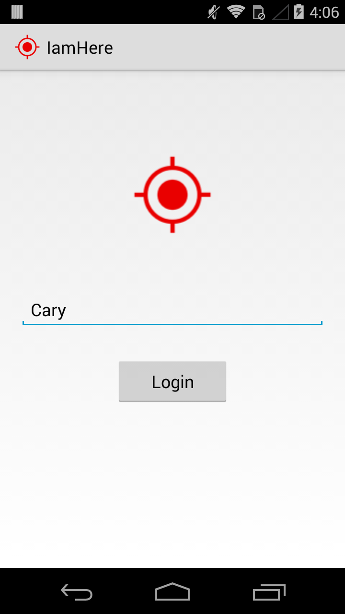
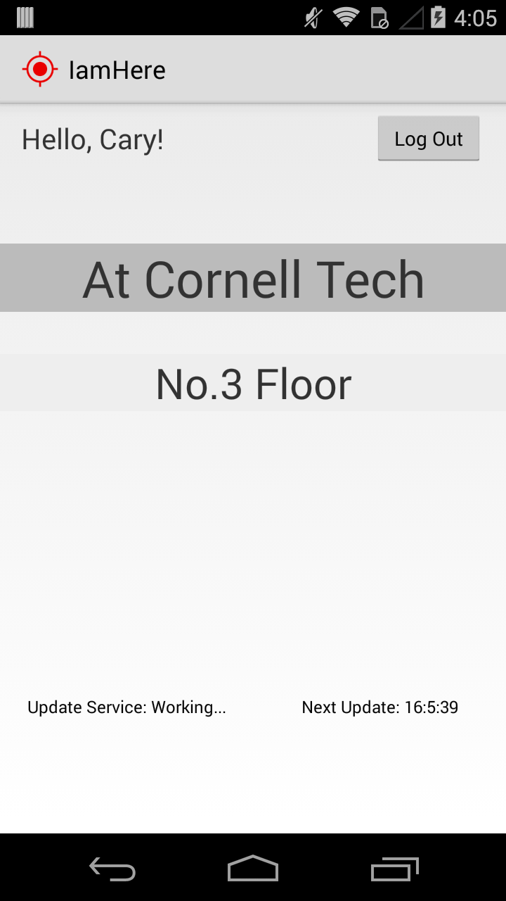

# iamhere

An Android application that can detect user's location.

It uses Geofence to detect if the user is in a special place(in this project, it's Cornell Tech). When the user enters the place, the app will update the "in" status to a server every 10 minutess. So others could find who else are in the place via the online user list which maintained by the server.

# Screenshots

